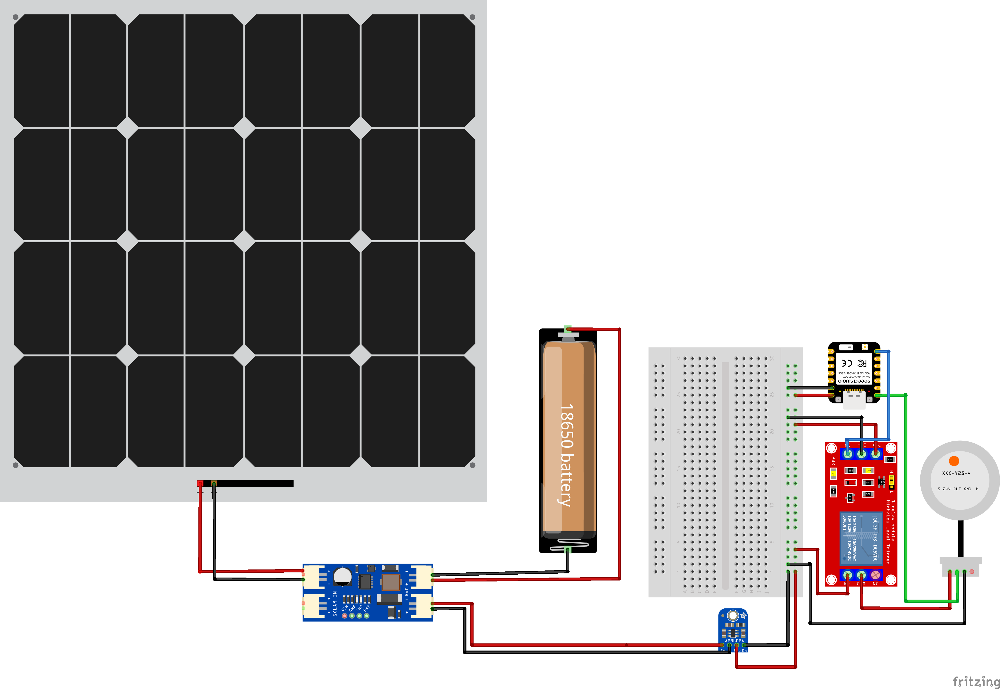
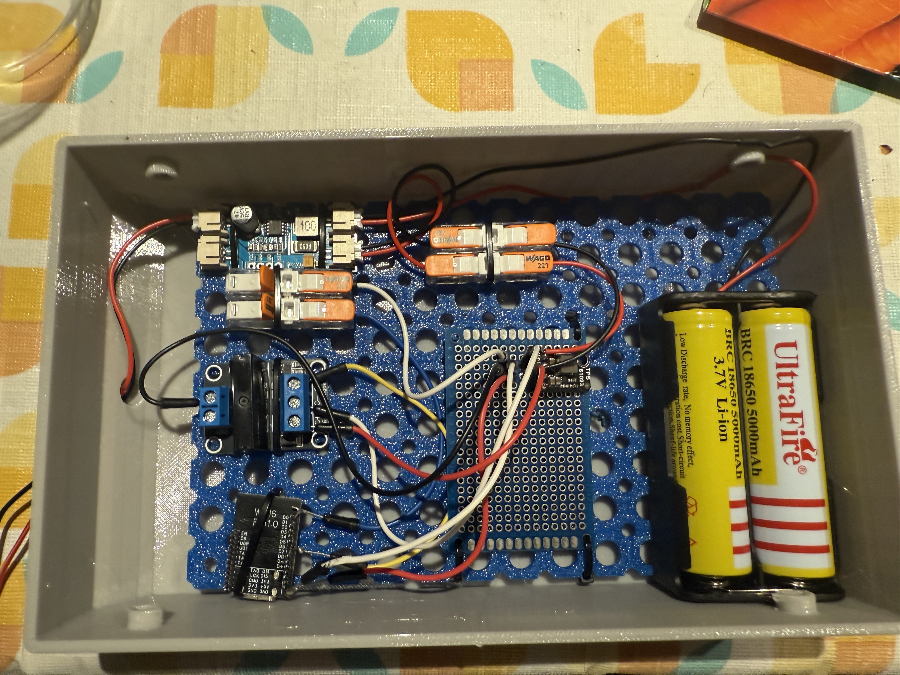
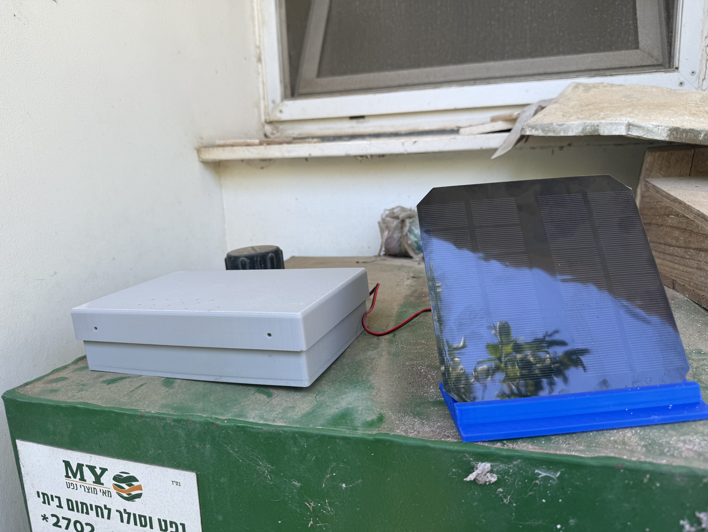
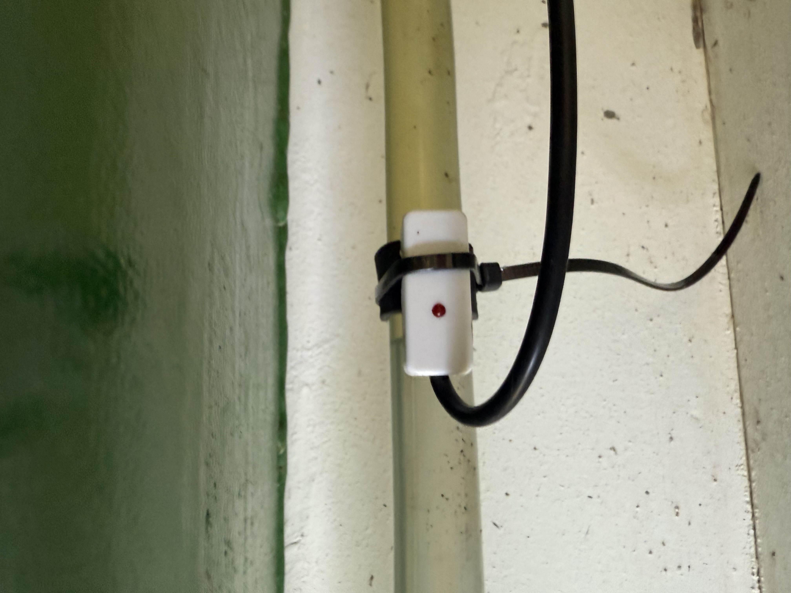

# 🛢️ Oil Level Guard

## 🛢️ Overview

I have an oil tank that supplies heating to my house. After running out of oil more than once in the middle of winter — simply because I forgot to check the tank level — I decided to automate the process.

I developed a simple but effective project that automatically detects when the oil level in the tank drops below a certain threshold. To do this, I installed a liquid presence detector on the tank’s indicator pipe.

The sensor is connected to an ESP32-C6 microcontroller, which transmits the data via Zigbee to my Home Assistant setup.

## 📸 Project Images

Below are images of the final setup and installation:

- 
- 
- 
- 


## 🔋 Power & Efficiency

The device is completely off-grid:

- Powered by a **6V solar panel** charging a **single 18650 battery**
- Uses a **relay** to power the sensor only during readings
- ESP32 wakes every **2 hours**, checks the level, transmits status, then enters **deep sleep**
- Optimized for ultra-low power usage

## 🛠️ How It Works

1. Every 2 hours, ESP32 wakes from deep sleep
2. It enables power to the sensor via relay
3. Sensor checks for oil presence
4. Status is transmitted via Zigbee to Home Assistant
5. ESP32 adds a slight random variation to readings (to overcome Zigbee's no-change-no-send bug)
6. Device goes back to sleep

## 📦 Bill of Materials

| #  | Component                   | Purpose                             | Model / Specs                  | Buy Link | Price (USD) |
|----|-----------------------------|-------------------------------------|--------------------------------|----------|-------------|
| 1  | ESP32-C6 Dev Board          | Controller (Zigbee + Wi-Fi 6)       | ESP32-C6-WROOM-1 (USB-C)       | [eBay](https://www.ebay.com/itm/286165884292) | ~$6.80 |
| 2  | Liquid Presence Sensor      | Detect oil via pipe (non-contact)   | XKC-Y26-PNP                    | Amazon / AliExpress | ~$10–15 |
| 3  | Solar Charger               | MPPT battery charging from solar    | CN3791                         | AliExpress | ~$7.70 |
| 4  | Relay Module                | Power control for sensor            | Standard 1-channel 5V relay    | AliExpress | ~$1–3 |
| 5  | 18650 Battery Holder        | Battery housing                     | 1-cell 18650 holder            | AliExpress | ~$1–2 |
| 6  | Solar Panel                 | Powers the system                   | 6V 1W (110×69 mm)              | [AliExpress](https://www.aliexpress.com/item/1005002796119334.html) | ~$7.30 |
| 7  | Step-Up Converter           | Boost 3.7V to 5V                     | MT3608 DC-DC Boost Module      | [AliExpress](https://www.aliexpress.com/item/1005006678339221.html) | ~$3.64 |


## 🧰 Implementation Notes

- Sensor shows as a *temperature sensor* in Home Assistant:
  - Value > 90 = oil detected
  - Value < 10 = oil not detected
- Random offset added to avoid Zigbee not re-sending identical values
- Sensor is **non-invasive** for safety
- Adjust sensor sensitivity **after mounting**
- Use **zip ties** to secure the sensor to the pipe

## 🧱 3D Printed Enclosure

All components are mounted inside a custom 3D-printed enclosure:

- Box, Lid, and Solar Panel Stand available on [OnShape](https://cad.onshape.com/documents/b10629fecaf0ac9edbcd4630/w/6cedf870c4686d0133f1f7d6/e/6562cfb349b612dd35926ae9?renderMode=0&uiState=6870e38f8febda307c57b175)
- Use **PETG or ASA** filament (for outdoor durability)

In order to arrange all the components I’ve used the CheeseBoard (14×9), which you can find and print from here:
- STL Model: [https://makerworld.com/en/models/1489078-parametric-cheeseboard#profileId-1557285](https://makerworld.com/en/models/1489078-parametric-cheeseboard#profileId-1557285)
- More details about the CheeseBoard project: [https://makerworld.com/en/models/1475104-cheeseboard#profileId-1539374](https://makerworld.com/en/models/1475104-cheeseboard#profileId-1539374)

## 📁 Directory Structure

```
OilLevelGuard/
│
├── Docs/           # Documentation (Fritzing diagram, BOM)
├── Src/            # Source code for ESP32-C6
├── 3D/             # STEP files and STL models for enclosure
└── Images/         # Photos of installed system
```

## 🏠 Home Assistant Integration

The device integrates as a Zigbee temperature sensor. Use Home Assistant’s automation to interpret values and generate alerts when oil runs low.

## 📜 License

This project is open-source and available under the MIT License.

## 🤝 Contributing

Pull requests are welcome. For major changes, please open an issue first to discuss what you would like to change.

## 📬 Contact

For questions or suggestions, feel free to reach out via [my GitHub profile](https://github.com/koblevi).
